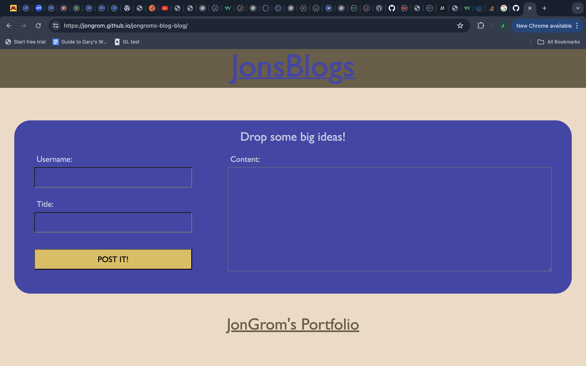

# jongroms-blog-blog#

In this assignment, I built a blog page that logs posts in local storage and adds them to a separate page using local storage. The blog page is equipped with a themeswitcher, which toggles between light mode and dark mode.

## Link to Deployed Version
[Click here to see the deployed version](https://jongrom.github.io/jongroms-blog-blog/)

## Screenshot of the Deployed Version

